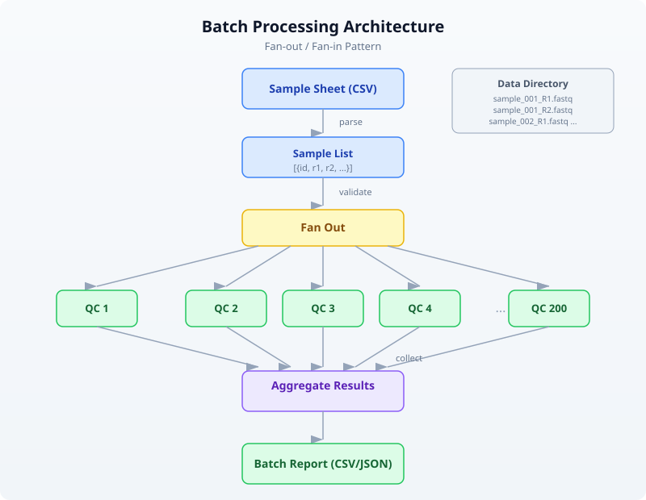
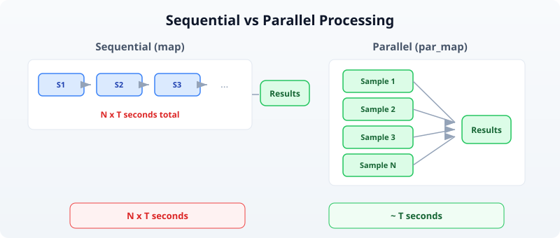

# Day 23: Batch Processing and Automation

| | |
|---|---|
| **Difficulty** | Intermediate |
| **Biology knowledge** | Basic (FASTQ quality, sample sheets, sequencing runs) |
| **Coding knowledge** | Intermediate (functions, records, file I/O, parallel execution, error handling) |
| **Time** | ~3 hours |
| **Prerequisites** | Days 1--22 completed, BioLang installed (see Appendix A) |
| **Data needed** | Generated locally via `init.bl` |

## What You'll Learn

- Why batch processing is essential for modern sequencing throughput
- How to parse sample sheets and discover files by directory traversal
- How to design per-sample processing functions that compose into batch workflows
- How to use parallel execution to process hundreds of samples efficiently
- How to track progress and log results across large batches
- How to handle errors gracefully so one failed sample does not halt 199 others
- How to aggregate per-sample results into cohort-level summaries

---

## The Problem

*"I have 200 samples --- do I really have to run each one manually?"*

Your sequencing core facility just delivered the latest run: 200 paired-end samples from a population genetics study. Each sample has a forward and reverse FASTQ file, totaling 400 files. The sample sheet maps sample IDs to file paths, tissue types, and expected coverage depths.

Yesterday, you built a reproducible pipeline for a single sample. You validated parameters, checksummed inputs, ran quality filtering, and logged provenance. That pipeline works perfectly --- for one sample. Now you need to run it 200 times, collect all the results, and produce a cohort-level summary.

You could copy-paste your single-sample script 200 times, changing the filename each time. You could write a shell loop. You could open 200 terminal tabs. All of these approaches share the same problems: they are error-prone, they do not track which samples succeeded or failed, and they do not aggregate results.

What you need is a **batch processing framework**: a pattern for taking a single-sample pipeline and running it across an entire cohort, with progress tracking, error recovery, and automatic aggregation. That is what we build today.

---

## The Scale of Modern Sequencing

Before we write code, let us understand why batch processing is not optional. A modern Illumina NovaSeq 6000 produces up to 6 terabytes of data per run. A typical run might contain:

- **96--384 samples** on a single flow cell
- **2 files per sample** (paired-end: R1 and R2)
- **10--50 million reads per sample**
- **A sample sheet** mapping barcodes to sample IDs

At this scale, manual processing is not merely tedious --- it is impossible. Even if each sample takes only 30 seconds to process, 200 samples at 30 seconds each is nearly two hours of wall-clock time. But if your single-sample pipeline takes 5 minutes (common for real QC), you are looking at 16 hours of sequential processing. With parallelism, you can bring that down to the time it takes to process one sample.

The following diagram shows the batch processing flow:



The key insight is the **fan-out / fan-in** pattern. You start with a list of samples, fan out to process each one independently, then fan back in to aggregate the results. Each sample is independent --- if sample 47 fails, samples 1--46 and 48--200 are unaffected.

---

## Setting Up the Project

Generate the test data for today's exercises:

```bash
bl run init.bl
```

The `init.bl` script creates a realistic batch processing scenario:

```
# init.bl creates:
# data/sample_sheet.csv    — sample sheet with 24 samples
# data/fastq/              — 24 FASTQ files (one per sample)
# results/                 — output directory
# logs/                    — batch log directory
```

We use 24 samples instead of 200 to keep runtimes short during learning, but the patterns we develop work identically at any scale.

---

## Sample Sheet Parsing

A sample sheet is the bridge between the sequencing instrument and your analysis. It maps each sample to its files, metadata, and processing instructions. In production, sample sheets come from the core facility in CSV or TSV format. Here is what ours looks like:

```csv
sample_id,fastq_file,tissue,expected_reads,group
SAMP_001,data/fastq/SAMP_001.fastq,blood,500,control
SAMP_002,data/fastq/SAMP_002.fastq,liver,500,treatment
SAMP_003,data/fastq/SAMP_003.fastq,brain,500,control
...
```

Parsing a sample sheet in BioLang is a single function call:

```bio
let sheet = read_csv("data/sample_sheet.csv")
```

> **Requires CLI:** This example uses file I/O not available in the browser. Run with `bl run`.

This returns a table with named columns. You can inspect it, filter it, and iterate over it. But before you process anything, you should validate that every file in the sample sheet actually exists:

```bio
fn validate_sample_sheet(sheet) {
    let files = sheet |> select("fastq_file") |> flatten()
    let missing = files |> filter(|f| !file_exists(f))
    missing
}

let missing = validate_sample_sheet(sheet)
if len(missing) > 0 then {
    println("ERROR: Missing files: " + str(missing))
    error("Cannot proceed with missing input files")
}
```

This is a critical safety check. If the core facility misspelled a filename or your data transfer was incomplete, you want to know immediately --- not after processing 150 samples and encountering a crash on sample 151.

### Extracting Samples as Records

Tables are convenient for viewing data, but for per-sample processing, you want a list of records where each record contains all the information about one sample:

```bio
fn sheet_to_samples(sheet) {
    let ids = col(sheet, "sample_id")
    let files = col(sheet, "reads_file")
    let tissues = col(sheet, "tissue")
    let groups = col(sheet, "condition")
    range(0, len(ids)) |> map(|i| {
        id: ids[i],
        fastq: files[i],
        tissue: tissues[i],
        group: groups[i]
    })
}

let samples = sheet_to_samples(sheet)
```

Now `samples` is a list of records like `{id: "SAMP_001", fastq: "data/fastq/SAMP_001.fastq", tissue: "blood", group: "control"}`. Each record is a self-contained description of what to process and where to find it.

---

## Directory-Based Discovery

Not every sequencing run comes with a sample sheet. Sometimes you receive a directory full of FASTQ files and need to discover samples programmatically. This is common when downloading public datasets from SRA or ENA, or when working with legacy data.

BioLang's `list_dir()` function returns the contents of a directory. Combined with `filter()` and string operations, you can build a sample list from file paths alone:

```bio
fn discover_samples(data_dir) {
    let all_files = list_dir(data_dir)
    let fastq_files = all_files |> filter(|f| ends_with(f, ".fastq"))
    fastq_files |> map(|f| {
        let basename = f |> split("/") |> sort() |> reduce(|a, b| b)
        let sample_id = basename |> replace(".fastq", "")
        {
            id: sample_id,
            fastq: f,
            tissue: "unknown",
            group: "unknown"
        }
    })
}
```

This approach is useful for ad-hoc analyses, but sample-sheet-driven processing is preferred whenever metadata is available. A sample sheet carries tissue type, expected read count, experimental group, and other annotations that directory traversal cannot infer.

### When to Use Each Approach

```
Decision: How to find samples
==============================

  Have a sample sheet?
     │
     ├── YES → Parse CSV/TSV
     │         ✓ Metadata included
     │         ✓ Explicit file mapping
     │         ✓ Validates against manifest
     │
     └── NO  → Discover from directory
              ✓ Works with any file structure
              ✗ No metadata (tissue, group)
              ✗ Naming conventions must be consistent
```

---

## Per-Sample Processing Functions

The core of any batch pipeline is a function that processes a single sample and returns a structured result. This function should be **pure** --- it takes a sample record as input, processes it, and returns a result record. It should not modify global state or depend on information outside its arguments.

Here is a complete per-sample QC function:

```bio
fn process_sample(sample, config) {
    let t = timer_start()
    let reads = read_fastq(sample.fastq)
    let total = len(reads)

    let filtered = reads |> filter(|r| mean_phred(r.quality) >= config.min_quality)
    let passed = filtered |> filter(|r| len(r.seq) >= config.min_length)
    let pass_count = len(passed)

    let gc_values = passed |> map(|r| gc_content(r.seq))
    let lengths = passed |> map(|r| len(r.seq))

    {
        sample_id: sample.id,
        tissue: sample.tissue,
        group: sample.group,
        total_reads: total,
        passed_reads: pass_count,
        pass_rate: pass_count / total,
        gc_mean: mean(gc_values),
        gc_stdev: stdev(gc_values),
        length_mean: mean(lengths),
        length_min: min(lengths),
        length_max: max(lengths),
        elapsed: timer_elapsed(t)
    }
}
```

Notice what this function does *not* do:

- It does not print progress messages (that is the caller's job)
- It does not write files (results are returned, not saved)
- It does not handle errors (the caller wraps it in `try/catch`)
- It does not know about other samples (it processes exactly one)

This separation of concerns is what makes the function composable. You can call it once for testing, map it over 24 samples for a pilot study, or par_map it over 200 samples for a full cohort.

---

## Parallel Batch Execution

Sequential processing --- `map(|s| process_sample(s, config))` --- works correctly but wastes time. If your machine has 8 cores and each sample takes 5 seconds, processing 200 samples sequentially takes 1,000 seconds. With 8-way parallelism, it takes 125 seconds.

BioLang's `par_map()` distributes work across available cores:

```bio
let results = samples |> par_map(|s| process_sample(s, config))
```

That is the entire change. Replace `map` with `par_map`, and your pipeline runs in parallel. The results are collected in the same order as the input, so `results[0]` always corresponds to `samples[0]`.



### When to Parallelize

Not every workload benefits from parallelism. The overhead of distributing work and collecting results means that very fast operations (under 10 milliseconds per item) may actually run slower with `par_map` than with `map`. Use this rule of thumb:

| Per-item time | Recommendation |
|---|---|
| < 10 ms | Use `map` (overhead dominates) |
| 10 ms -- 1 s | `par_map` if batch > 50 items |
| > 1 s | Always use `par_map` |

For bioinformatics workloads, individual samples almost always take more than a second, so `par_map` is the default choice.

---

## Progress and Logging

When processing 200 samples, silence is unacceptable. You need to know which sample is being processed, how many have completed, and how long the batch is taking. But you also do not want to flood the console with 200 lines of output.

A good batch progress system reports:
1. **Start**: total count and configuration
2. **Periodic updates**: every N samples or every M seconds
3. **Completion**: total time, success/failure counts

Here is a pattern that processes samples one at a time with progress reporting:

```bio
fn run_batch_with_progress(samples, config) {
    let total = len(samples)
    let t_batch = timer_start()
    let results = []
    let errors = []

    samples |> each(|s| {
        let idx = len(results) + len(errors) + 1
        try {
            let result = process_sample(s, config)
            results = results + [result]
            if idx % 5 == 0 then {
                let elapsed = timer_elapsed(t_batch)
                let rate = idx / elapsed
                let remaining = (total - idx) / rate
                println("[" + str(idx) + "/" + str(total) + "] " + str(int(remaining)) + "s remaining")
            }
        } catch err {
            errors = errors + [{sample_id: s.id, error: str(err)}]
            println("WARN: " + s.id + " failed: " + str(err))
        }
    })

    {
        results: results,
        errors: errors,
        total_time: timer_elapsed(t_batch)
    }
}
```

This function processes each sample, catches errors individually, and prints a progress update every 5 samples. The rate calculation (`idx / elapsed`) gives a simple estimate of remaining time.

### Logging to File

Console output disappears when the terminal closes. For batch processing, you should also write a log file:

```bio
fn write_batch_log(log_file, batch_result) {
    let lines = []
    let lines = lines + ["Batch completed at: " + (now() |> format_date("%Y-%m-%d %H:%M:%S"))]
    let lines = lines + ["Total time: " + str(batch_result.total_time) + " seconds"]
    let lines = lines + ["Succeeded: " + str(len(batch_result.results))]
    let lines = lines + ["Failed: " + str(len(batch_result.errors))]
    let lines = lines + [""]

    if len(batch_result.errors) > 0 then {
        let lines = lines + ["Failed samples:"]
        batch_result.errors |> each(|e| {
            lines = lines + ["  " + e.sample_id + ": " + e.error]
        })
    }

    write_lines(log_file, lines)
}
```

---

## Error Recovery

In batch processing, errors are inevitable. A corrupted FASTQ file, a sample with zero reads, a disk that fills up mid-run --- these things happen. The question is not whether errors will occur but how your pipeline handles them.

The worst possible behavior is to crash on the first error, losing all progress. The 150 samples that already succeeded produce no output because the pipeline exited before writing results. This is catastrophic when each sample takes minutes to process.

The correct approach is **error isolation**: each sample is processed independently, errors are caught and recorded, and the batch continues. At the end, you have results for all successful samples and a clear list of failures to investigate.

```
Error Recovery Pattern
======================

  Sample 1  ──► OK    ──► result
  Sample 2  ──► OK    ──► result
  Sample 3  ──► FAIL  ──► log error, continue
  Sample 4  ──► OK    ──► result
  Sample 5  ──► OK    ──► result
  ...
  Sample N  ──► OK    ──► result

  Final: 198 results + 2 errors
  (not: crash after sample 3, lose everything)
```

The `try/catch` pattern we used in `run_batch_with_progress` above implements this. Each sample is wrapped in its own error boundary. A failure in one sample does not affect any other.

### Retry Logic

Some errors are transient --- a temporary network issue when downloading a reference, a brief I/O contention on shared storage. For these, retrying the operation often succeeds:

```bio
fn process_with_retry(sample, config, max_retries) {
    let attempts = 0
    let last_error = ""
    let result = nil

    range(0, max_retries) |> each(|attempt| {
        if result == nil then {
            try {
                result = process_sample(sample, config)
            } catch err {
                last_error = str(err)
                attempts = attempt + 1
            }
        }
    })

    if result == nil then {
        error("Failed after " + str(max_retries) + " attempts: " + last_error)
    }

    result
}
```

In production pipelines, retries are most useful for I/O-bound operations (network, disk). CPU-bound operations (quality filtering, statistics) either succeed or fail deterministically --- retrying them wastes time without changing the outcome.

---

## Aggregating Results

After processing all samples, you have a list of per-sample result records. The next step is to aggregate these into a cohort-level summary. This serves two purposes: it provides a quick overview of the entire batch, and it identifies outlier samples that may need manual review.

### Per-Sample Summary Table

The simplest aggregation is a table with one row per sample:

```bio
fn build_summary_table(results) {
    results |> map(|r| {
        sample_id: r.sample_id,
        tissue: r.tissue,
        group: r.group,
        total_reads: r.total_reads,
        passed_reads: r.passed_reads,
        pass_rate: r.pass_rate,
        gc_mean: r.gc_mean,
        length_mean: r.length_mean
    }) |> to_table()
}
```

### Group-Level Statistics

For experiments with treatment and control groups, you often want summary statistics *per group*. BioLang's `group_by` and `summarize` make this straightforward:

```bio
fn summarize_by_group(results) {
    results |> group_by("group") |> summarize(|grp, rows| {
        group: grp,
        n_samples: nrow(rows),
        mean_pass_rate: col_mean(rows, "pass_rate"),
        mean_gc: col_mean(rows, "gc_mean"),
        mean_reads: col_mean(rows, "total_reads")
    })
}
```

### Outlier Detection

Samples with unusual metrics may indicate technical problems (failed library prep, contamination, index hopping) or genuine biological differences. A simple approach flags samples whose metrics fall outside 2 standard deviations of the cohort mean:

```bio
fn flag_outliers(results, field) {
    let values = results |> map(|r| {
        if field == "pass_rate" then r.pass_rate
        else if field == "gc_mean" then r.gc_mean
        else r.length_mean
    })
    let m = mean(values)
    let s = stdev(values)
    let lower = m - 2.0 * s
    let upper = m + 2.0 * s

    results |> filter(|r| {
        let v = if field == "pass_rate" then r.pass_rate
                else if field == "gc_mean" then r.gc_mean
                else r.length_mean
        v < lower or v > upper
    }) |> map(|r| r.sample_id)
}
```

This is a coarse screen, not a definitive classification. Outlier samples should be reviewed manually before being excluded from downstream analysis.

---

## Putting It All Together

Here is the complete batch processing pipeline, assembled from the components we developed above:

> **Requires CLI:** This example uses file I/O not available in the browser. Run with `bl run`.

```bio
let config_text = read_lines("config.json") |> reduce(|a, b| a + b)
let config = json_decode(config_text)

let sheet = read_csv("data/sample_sheet.csv")
let missing = validate_sample_sheet(sheet)
if len(missing) > 0 then {
    error("Missing input files: " + str(missing))
}

let samples = sheet_to_samples(sheet)
let batch = run_batch_with_progress(samples, config)

let summary = build_summary_table(batch.results)
summary |> write_csv(config.output_dir + "/batch_summary.csv")

let group_stats = summarize_by_group(batch.results)
let group_table = group_stats |> to_table()
group_table |> write_csv(config.output_dir + "/group_summary.csv")

let gc_outliers = flag_outliers(batch.results, "gc_mean")
let rate_outliers = flag_outliers(batch.results, "pass_rate")

let report = {
    timestamp: now() |> format_date("%Y-%m-%d %H:%M:%S"),
    total_samples: len(samples),
    succeeded: len(batch.results),
    failed: len(batch.errors),
    total_time: batch.total_time,
    gc_outliers: gc_outliers,
    rate_outliers: rate_outliers,
    errors: batch.errors
}
write_lines(config.log_dir + "/batch_report.json", [json_encode(report)])
```

This pipeline:
1. Loads configuration from a JSON file
2. Parses the sample sheet and validates that all files exist
3. Processes all samples with progress tracking and error isolation
4. Builds per-sample and per-group summary tables
5. Flags statistical outliers for manual review
6. Writes a batch report with timing, error counts, and outlier lists

---

## Automation

The final step in a batch processing workflow is making it fully automated. An automated pipeline can be triggered by a cron job, a file watcher, or a sequencing instrument completion signal. It should require zero human intervention for the common case and produce clear alerts when something goes wrong.

### The Automation Script Pattern

An automation wrapper handles the lifecycle around your pipeline:

> **Requires CLI:** This example uses file I/O not available in the browser. Run with `bl run`.

```bio
fn run_automated_batch(sheet_path, config_path) {
    let t = timer_start()

    let config_text = read_lines(config_path) |> reduce(|a, b| a + b)
    let config = json_decode(config_text)

    mkdir(config.output_dir)
    mkdir(config.log_dir)

    let sheet = read_csv(sheet_path)
    let missing = validate_sample_sheet(sheet)
    if len(missing) > 0 then {
        let alert = {
            status: "FAILED",
            reason: "missing_files",
            files: missing,
            timestamp: now() |> format_date("%Y-%m-%d %H:%M:%S")
        }
        write_lines(config.log_dir + "/alert.json", [json_encode(alert)])
        error("Batch aborted: missing files")
    }

    let samples = sheet_to_samples(sheet)
    let batch = run_batch_with_progress(samples, config)

    let summary = build_summary_table(batch.results)
    summary |> write_csv(config.output_dir + "/batch_summary.csv")

    let report = {
        status: if len(batch.errors) == 0 then "SUCCESS" else "PARTIAL",
        total_samples: len(samples),
        succeeded: len(batch.results),
        failed: len(batch.errors),
        total_time: timer_elapsed(t),
        errors: batch.errors
    }
    write_lines(config.log_dir + "/batch_report.json", [json_encode(report)])

    report
}
```

### Integrating with Shell

To trigger a BioLang batch pipeline from a shell script or cron job:

```bash
#!/bin/bash
# nightly_batch.sh — run QC on any new sample sheets

SHEET_DIR="/data/sequencing/incoming"
CONFIG="/opt/pipelines/qc_config.json"

for sheet in "$SHEET_DIR"/*.csv; do
    echo "Processing: $sheet"
    bl run automation.bl -- "$sheet" "$CONFIG"
done
```

The `--` separator passes arguments to the BioLang script. This pattern integrates BioLang pipelines into existing infrastructure without requiring changes to the surrounding automation.

---

## Exercises

### Exercise 1: Tissue-Specific QC Thresholds

Modify the batch pipeline to support different quality thresholds per tissue type. Create a configuration that specifies `min_quality: 25` for blood samples and `min_quality: 20` for all other tissues. Process the sample sheet with tissue-aware filtering and compare the pass rates.

*Hint*: Add a `tissue_thresholds` record to your config, then look up the threshold for each sample's tissue type inside `process_sample`.

### Exercise 2: Checkpoint and Resume

Real batch jobs can be interrupted (power failure, killed process, disk full). Write a batch pipeline that saves a checkpoint file after each sample. If the pipeline is restarted, it reads the checkpoint, skips already-completed samples, and resumes from where it left off.

*Hint*: Write completed sample IDs to a file. On startup, read that file and filter out already-processed samples from the sample list.

### Exercise 3: Cross-Sample Contamination Check

After processing all samples, compare the k-mer profiles between samples in different groups. If two samples from different groups have highly similar k-mer distributions, flag them as potential cross-contamination. Use `kmers(seq, 5)` to build k-mer frequency profiles and compare them.

*Hint*: For each sample, build a k-mer frequency record from the first 50 passed reads. Compare all pairs of samples across groups using a similarity metric (e.g., shared k-mer fraction).

### Exercise 4: Batch Report Generator

Write a script that reads a `batch_report.json` file and a `batch_summary.csv` file, then produces a human-readable text report with:
- Run timestamp and total time
- Success/failure counts
- Top 5 and bottom 5 samples by pass rate
- Per-group averages
- List of any flagged outliers

*Hint*: Use `read_csv()` for the summary, `json_decode()` for the report, and `sort()` to rank samples.

---

## Key Takeaways

```
┌─────────────────────────────────────────────────────────────┐
│                    Day 23 Key Takeaways                     │
├─────────────────────────────────────────────────────────────┤
│                                                             │
│  1. Parse sample sheets, don't hardcode file lists.         │
│     read_csv() turns a sample sheet into a structured       │
│     table you can validate and iterate.                     │
│                                                             │
│  2. Write single-sample functions first. A function         │
│     that processes one sample correctly can be mapped       │
│     over any number of samples via map or par_map.          │
│                                                             │
│  3. Use par_map for parallelism. Replacing map with         │
│     par_map is a one-word change that can cut batch         │
│     time by 4-8x on modern hardware.                       │
│                                                             │
│  4. Isolate errors with try/catch per sample. One           │
│     failed sample should never crash an entire batch        │
│     of 200.                                                 │
│                                                             │
│  5. Track progress. Print periodic updates with             │
│     estimated time remaining. Write logs to files           │
│     that survive terminal disconnections.                   │
│                                                             │
│  6. Aggregate and flag. Per-sample results become           │
│     group summaries and outlier lists. Automation           │
│     means detecting problems, not just producing            │
│     numbers.                                                │
│                                                             │
│  7. Automate the lifecycle. A production pipeline           │
│     validates inputs, processes samples, writes             │
│     results, logs errors, and can be triggered by           │
│     a cron job or file watcher.                             │
│                                                             │
└─────────────────────────────────────────────────────────────┘
```

---

## What's Next

Tomorrow in **Day 24**, we move from processing data locally to working with **cloud and cluster resources**. You will learn how to submit batch jobs to remote compute, monitor their progress, and collect results across distributed systems. The batch processing patterns from today --- fan-out, error isolation, aggregation --- are the foundation of every distributed pipeline.
