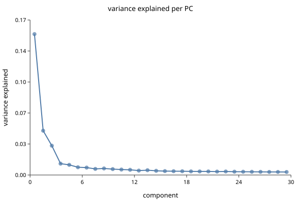

# Normalization and PCA

*Follows HBC lessons 06 (Theory of PCA) and 07 (SCTransform normalization).*

## Why the course teaches PCA first

This looks wrong the first time. Normalization comes before PCA in the pipeline,
so why teach PCA first?

Because you cannot judge a normalization without a way to look at its result.
"Did this normalization work?" means "are cells now grouped by biology rather
than by sequencing depth?", and answering it requires a projection. Teaching the
tool before the step that needs it is the right way round.

## PCA in one paragraph

You have a cell described by 15,576 gene measurements — a point in 15,576
dimensions. Most of those dimensions carry nothing: genes nobody expresses,
genes everybody expresses equally, genes that are noise. Many move together,
because genes work in programs.

PCA finds new axes as weighted combinations of genes, ordered so the first
captures the most variance, the second the most of what remains. The first ten
or twenty usually carry the structure; the rest carry noise.

The intuition to keep: **each PC is a gene program**, and a cell's coordinate on
it is how strongly that cell runs the program. PC1 is often "which broad lineage
is this", and later PCs get more specific.

```biolang
import "singlecell" as sc

let obj = sc.load("ctrl_raw")
    |> sc.filter_genes(3)
    |> sc.filter_cells(250, 100000, 20.0)
    |> sc.normalize()
    |> sc.variable_genes(2000)
    |> sc.run_pca(30)

write_text("elbow.svg", sc.plot_elbow(obj, 30))
```



Read where it flattens. Components before the bend carry structure; after it,
noise. The bend is rarely sharp, and that is fine — taking a few too many PCs
costs much less than cutting into real signal, so err high. The course settles
on a similar range for this data.

## Why raw counts cannot go into PCA

Two problems, and they compound.

**Depth.** One cell yields 20,000 UMIs, its neighbour 5,000. Every gene in the
first looks four times higher, and PC1 becomes "how deeply was this cell
sequenced" — a technical axis dominating the plot.

**Mean–variance coupling.** Count variance grows with the mean, so highly
expressed genes vary more in absolute terms simply because they are high. PCA
maximises variance, so without correction it selects for expression level rather
than information.

The standard fix handles both — scale each cell to a common total, then `log1p`:

```biolang
import "singlecell" as sc

let obj = sc.load("ctrl_raw")
    |> sc.filter_genes(3)
    |> sc.filter_cells(250, 100000, 20.0)
    |> sc.normalize(10000.0)

println("normalised layer present: " + str(contains(keys(obj), "norm_matrix")))
```

`normalize(10000.0)` is counts-per-ten-thousand followed by `log1p`. The 10,000
is arbitrary and does not matter; the log does the work, compressing the high end
so a handful of loud genes stop dominating.

Note it **adds** `norm_matrix` rather than overwriting `matrix`. Raw counts stay
available, which matters because differential expression should use counts, not
logs.

## Variable genes

Most genes are uninformative for distinguishing cell types — off everywhere or on
everywhere. Selecting genes that vary more than expected *for their expression
level* focuses PCA on structure.

```biolang
import "singlecell" as sc

let obj = sc.load("ctrl_raw")
    |> sc.filter_genes(3)
    |> sc.filter_cells(250, 100000, 20.0)
    |> sc.normalize()
    |> sc.variable_genes(2000)

println("HVGs: " + str(len(sc.get_hvg_genes(obj))))
```

"More than expected for their expression level" is the important clause. A raw
variance ranking returns the highest-expressed genes, which you already knew
about. The selection bins genes by mean expression and ranks dispersion *within*
each bin, so a moderately expressed gene that switches cleanly between cell types
can outrank a loud constitutive one.

2,000 is the conventional number and what the course uses.

## SCTransform

Log-normalization has a known weakness: it does not fully remove the
depth–expression relationship, and residual depth structure leaks into the PCs.
SCTransform fits a regularized negative binomial per gene with sequencing depth
as a covariate and uses the Pearson residuals as corrected values.

```biolang
import "singlecell" as sc

let obj = sc.load("ctrl_raw")
    |> sc.filter_genes(3)
    |> sc.filter_cells(250, 100000, 20.0)
    |> sc.sctransform()

println("sctransform applied to " + str(obj.n_cells) + " cells")
```

Use it when depth varies a lot across cells, or when integrating samples
sequenced to different depths. Use plain `normalize` when you want something
simple, fast and easy to explain.

### It costs memory that log-normalization does not

A Pearson residual is `(count - mu) / sqrt(var)`, and when the count is zero that
is `-mu/sqrt(var)`, which is not zero. **So the output is dense no matter how
sparse the input was.** A 15,000 × 15,576 matrix that occupies a few hundred
megabytes as counts becomes 1.9 GB as residuals; the integrated object in
[Integration](ch04-integration.md) becomes 4 GB. This is the step that runs
people out of memory, and it is not a bug — it is what the method returns.

The next step throws most of it away. Pass a feature count and only the genes
that survive selection are computed:

```biolang
let obj = merged |> sc.sctransform(3000)
```

Genes are ranked by the variance of their residuals and the top 3,000 kept,
which is `SCTransform(variable.features.n = 3000)` in Seurat and drops that 4 GB
to 711 MB. The residual values are identical either way — the argument changes
which columns you get back, not what is in them.

A capped call also fills `obj.hvg`, because ranking by residual variance *is*
variable-gene selection under this normalization. Do not follow it with
`sc.variable_genes`.

The two produce different downstream clusters. Pick one and keep it for the whole
analysis rather than switching partway — and say which you used, because a reader
cannot tell from the figures.

## Next

You now have cells positioned in a space where distance means something. This
dataset has two samples, and that space is probably still organised partly by
sample rather than by biology — which is [Integration](ch04-integration.md).
