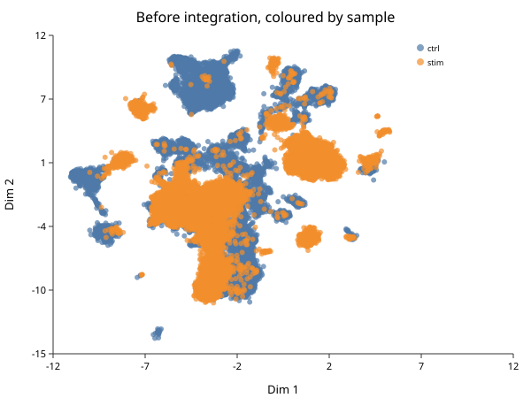
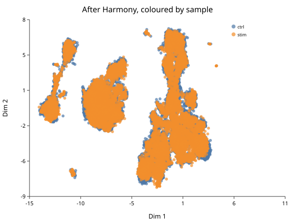

# Integration

*Follows HBC lessons 08 (CCA theory) and 09 (Harmony).*

The course splits integration into two lessons — one for the theory, one for the
code — and the split is worth keeping, because this is the step where a
plausible-looking result is most likely to be wrong.

## The problem, on this data

Merge the two samples and cluster them together:

```biolang
import "singlecell" as sc

# Cells are filtered per sample; genes must match across the two for the merge,
# so gene filtering happens after it.
let ctrl = sc.load("ctrl_raw") |> sc.filter_cells(250, 100000, 20.0)
let stim = sc.load("stim_raw") |> sc.filter_cells(250, 100000, 20.0)

let merged = sc.merge(ctrl, stim, "ctrl", "stim")
    |> sc.filter_genes(3)
    |> sc.normalize()
    |> sc.variable_genes(2000)
    |> sc.run_pca(30)
    |> sc.neighbors(15)
    |> sc.cluster_leiden(15, 0.5)

println("merged: " + str(merged.n_cells) + " cells, " +
        str(sc.get_clusters(merged) |> unique |> len) + " clusters")

let sample = merged.batch_ids |> map(|x| str(x))
write_text("integration-before.svg",
    sc.plot_embedding(merged, sample, "Before integration, coloured by sample"))
```

```text
merged: 30043 cells, 14 clusters
```



Look at the colours. Several islands are **almost entirely one sample** — a blue
island beside an orange island, repeatedly. The same cell type is appearing
twice, once per sample, and clustering is dutifully calling them different
populations.

That is the problem integration exists to solve.

## What is actually being corrected here

An honest caveat the mechanics can obscure. These two samples differ in **two**
ways at once:

1. They were prepared and sequenced separately — a technical batch effect.
2. One was stimulated with interferon-beta — a real, large biological effect,
   and the entire point of the experiment.

Integration cannot distinguish them. Aligning the samples removes some of the
interferon response along with the batch effect. That is a deliberate trade,
and it is the right one *for the purpose of matching cell types across
conditions*: you want the CD14 monocytes of both samples to land in one cluster
so you can then ask how they differ. It would be exactly wrong to integrate and
then declare the conditions similar — you removed the difference yourself.

**Integrate to align cell types. Test for condition effects on the uncorrected
counts, within cell type.**

If your samples were biological replicates processed together and they already
overlap, do not integrate at all. Cluster first; if the samples already mix,
stop. Integration is a repair, not a routine step.

## Harmony

Harmony (Korsunsky et al., 2019) works in PCA space rather than gene space,
which is why it is fast. It alternates two steps:

1. **Soft cluster** the cells, with a penalty that rewards clusters containing a
   mixture of samples. A cluster that is 100% one sample is penalised, pushing
   toward clusters that represent cell types rather than batches.
2. **Correct within each cluster** by regressing the batch out, producing a
   per-cell shift.

The second step is the one that matters, and the reason is easy to miss.
Subtracting one global per-batch offset assumes the batch effect points the same
way for every cell type. It usually does not — a batch can shift T cells one way
and monocytes another. Correcting *within* clusters lets the correction differ
per cell type, which one global offset cannot do.

```biolang
import "singlecell" as sc

let ctrl = sc.load("ctrl_raw") |> sc.filter_cells(250, 100000, 20.0)
let stim = sc.load("stim_raw") |> sc.filter_cells(250, 100000, 20.0)
let merged = sc.merge(ctrl, stim, "ctrl", "stim")
    |> sc.filter_genes(3) |> sc.normalize() |> sc.variable_genes(2000)
    |> sc.run_pca(30) |> sc.neighbors(15) |> sc.cluster_leiden(15, 0.5)

let corrected = sc.harmony(merged, merged.batch_ids)

let sample = merged.batch_ids |> map(|x| str(x))
write_text("integration-after.svg",
    sc.plot_embedding(corrected, sample, "After Harmony, coloured by sample"))
```



> **`sc.integrate` is not Harmony.** It is a single global per-batch centering —
> a reasonable deterministic baseline, and the thing this book warns about above.
> Use `sc.harmony` when you mean Harmony. The two are easy to confuse because
> `integrate` is the more obvious name, and until recently the package exposed
> only the weaker one.

## How to tell whether it worked

This is the part that gets skipped, and it is the part that matters.

A batch-mixing metric alone is **maximised by collapsing every cell onto a single
point**. Perfect mixing, zero biology. So mixing is never sufficient evidence.
Every check must come in a pair:

- **Samples mix** — each island now contains cells from both, in roughly the
  proportions the samples contribute.
- **Cell types stay apart** — the populations distinguishable before integration
  are still distinguishable after.

Compare the two figures above on both counts. The sample-specific islands are
gone, and the islands themselves are still there — perhaps a dozen distinct
groups rather than one cloud. Both halves hold.

If you only ever check the first, you cannot detect over-correction, which is
the characteristic failure of every integration method. A UMAP that looks
beautifully mixed and has quietly merged your CD4 and CD8 T cells is a worse
outcome than no integration at all, because it looks like success.

The BioLang test suite for `harmony_integrate` asserts both as a pair for exactly
this reason: a mutation that subtracted the regression intercept made the batches
mix perfectly and collapsed cell-type separation from 15.91 to 0.00, and a
mixing-only test still passed.

## CCA, and why it is theory here

Canonical Correlation Analysis is the idea behind Seurat's original integration,
and it is worth understanding even though you will not run it at scale in
BioLang.

PCA on either dataset alone finds the directions of greatest variance *in that
dataset*, and a batch effect is often the largest single source. So PC1 becomes
the batch. CCA instead looks for directions **correlated between the two
datasets**. A batch effect present in only one cannot correlate with anything in
the other, so it scores poorly. Shared biology — T cells behaving like T cells in
both samples — scores well.

BioLang has a `cca` builtin and that property is demonstrable on small inputs.
But Seurat's CCA works on a cells × cells cross-product, and BioLang's
`Matrix::svd` is O(n⁴) — it stalls above roughly a hundred cells. Thirty thousand
is out of the question. **The theory is runnable and the practice is not**; use
Harmony, which is what lesson 09 does anyway.

## Next

With cell types aligned across samples, the numbered clusters can be named:
[Clustering](ch05-clustering.md) and then
[Markers and Annotation](ch06-markers.md).
