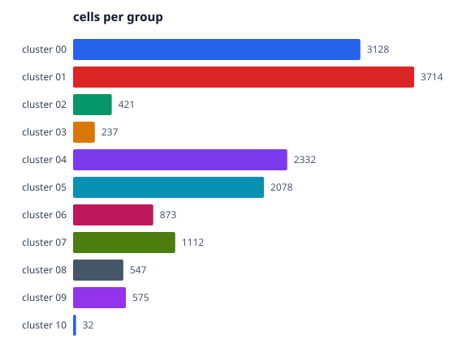
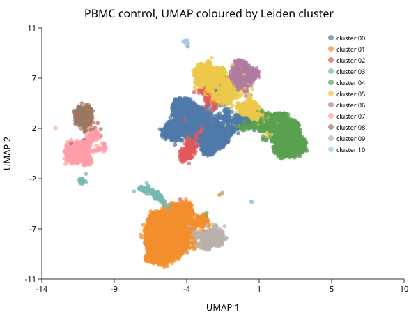

# Clustering

*Follows HBC lessons 10 (Clustering) and 11 (Clustering quality control).*

## Graph-based clustering

Three steps, and no distance threshold anywhere — which is why it suits this
data.

1. **Build a k-nearest-neighbour graph.** Each cell connects to its k closest
   neighbours in PCA space.
2. **Weight the edges** by how much two cells' neighbourhoods overlap — the
   Jaccard index of their neighbour sets, `shared / (2k − shared)` — and drop
   any edge below `1/15`. This is a **shared** nearest-neighbour graph.
3. **Find communities** — groups more densely connected internally than
   externally — with Leiden or Louvain.

Step 2 is worth dwelling on. A kNN edge says "these two cells are close"; an
SNN edge says "these two cells sit in the same neighbourhood", which is a much
stronger claim. It matters because in high-dimensional space the distance from
a point to its nearest neighbour and to its furthest converge — so proximity
alone stops discriminating exactly where single-cell data lives. Neighbourhood
overlap does not degrade that way: two cells of the same type keep sharing
neighbours however many dimensions you measure them in. The pruning does real
work too, since chance adjacencies score low and removing them is what stops
communities bleeding into each other.

`sc.neighbors` builds this by default, matching `FindNeighbors`. Pass
`snn = false` for a plain kNN graph weighted by `1 / (1 + distance)`, which is
faster and worse; it exists so that results produced before the SNN graph
existed can still be reproduced.

> **This page previously claimed BioLang weighted edges by neighbourhood
> overlap when it did not** — the code used inverse distance, while the text
> described Seurat's behaviour and then argued, correctly, that raw distance is
> unreliable in high dimensions. The argument was against what the code
> actually did. The SNN graph was implemented afterwards, and this section now
> describes what runs.

```biolang
import "singlecell" as sc

let obj = sc.load("ctrl_raw")
    |> sc.filter_genes(3)
    |> sc.filter_cells(250, 100000, 20.0)
    |> sc.normalize()
    |> sc.variable_genes(2000)
    |> sc.run_pca(30)
    |> sc.neighbors(15)
    |> sc.cluster_leiden(15, 0.5)

let labels = sc.get_clusters(obj)
println("clusters: " + str(labels |> unique |> len))
write_text("proportions.svg", sc.plot_proportions(obj))
```

```text
clusters: 11
```



Eleven clusters from 15,049 cells, ranging from 3,714 cells down to 32. That
spread is normal and worth noticing: PBMCs are dominated by a few common
populations, and the interesting biology is often in the small ones.

## Resolution is the knob, and it is not a truth setting

`resolution` controls how readily the algorithm splits a community. Low values
give few large clusters, high values many small ones.

**There is no correct resolution.** There is only one appropriate to the
question. If you want broad lineages, go low. If you want to separate activation
states within a lineage, go high and expect to justify each split.

```biolang
import "singlecell" as sc

let base = sc.load("ctrl_raw")
    |> sc.filter_genes(3)
    |> sc.filter_cells(250, 100000, 20.0)
    |> sc.normalize()
    |> sc.variable_genes(2000)
    |> sc.run_pca(30)
    |> sc.neighbors(15)

for r in [0.2, 0.5, 1.0] {
    let c = sc.cluster_leiden(base, 15, r)
    println("resolution " + str(r) + " -> " +
            str(sc.get_clusters(c) |> unique |> len) + " clusters")
}
```

Report the resolution you used. An analysis that does not state it cannot be
reproduced, because the cluster count is a function of it. The course lands on a
similar count to the eleven above; do not expect an exact match, for the reasons
in [What Differs from the Course](differences.md).

## Looking at it

```biolang
import "singlecell" as sc

let obj = sc.load("ctrl_raw")
    |> sc.filter_genes(3) |> sc.filter_cells(250, 100000, 20.0)
    |> sc.normalize() |> sc.variable_genes(2000) |> sc.run_pca(30)
    |> sc.neighbors(15) |> sc.cluster_leiden(15, 0.5)

write_text("umap.svg", sc.plot_umap(obj, "PBMC control, UMAP coloured by Leiden cluster"))
```



Read the **topology**, not the distances. Clusters 1 and 9 sit together at the
bottom; clusters 7 and 8 together on the left; 0, 2, 5 and 6 form the large mass
in the centre with 4 beside them. The next chapter shows those groupings are the
monocytes, the B cells, and the T cells with NK adjacent — so the layout
recovered relationships nobody told it about.

## UMAP is for looking, not for measuring

UMAP preserves local neighbourhoods. It does **not** preserve distance between
clusters. Two clusters appearing adjacent are not necessarily more similar than
two at opposite ends — that spacing is partly an artifact of the layout, and it
changes with the seed.

So: never argue from the picture. "These populations are related because they
are next to each other" is not an argument by itself. The clustering happened in
PCA space; the UMAP is a rendering of it, and every quantitative claim should
come from the space, not the rendering.

> This deserves more emphasis here than in most tutorials, because BioLang's
> UMAP was until recently producing a single featureless blob for any input —
> attraction with no reachable repulsion. The clustering was correct the whole
> time and the marker tables were correct the whole time; only the picture was
> wrong. If your embedding and your markers ever disagree, believe the markers.

## The lesson most tutorials skip

The algorithm always returns clusters. Run it on pure noise and you get clusters
— tidy, well-separated, meaningless. So "I have clusters" is not evidence of
anything, and the course is right to give this its own lesson placed *after*
clustering, because the question only becomes answerable once you have something
to interrogate.

Four checks, in the order I would run them.

**Is the cluster driven by QC metrics?** If one cluster is just the low-UMI cells
or the high-mitochondrial cells, it is a quality artifact wearing a cluster's
clothing.

```biolang
import "singlecell" as sc

let obj = sc.load("ctrl_raw")
    |> sc.filter_genes(3) |> sc.filter_cells(250, 100000, 20.0)
    |> sc.normalize() |> sc.variable_genes(2000) |> sc.run_pca(30)
    |> sc.neighbors(15) |> sc.cluster_leiden(15, 0.5)

let d = sc.cluster_diagnostics(obj)
println("mean silhouette: " + str(round(d.mean_score, 3)) +
        "  (scored " + str(d.n_scored) + " of " + str(d.n_cells) + " cells)")
```

```text
mean silhouette: 0.143  (scored 2150 of 15049 cells)
```

A silhouette compares every cell against every other, which is quadratic — at
15,049 cells that is 226 million distance computations, and it does not finish
in an interpreter. So it scores a deterministic subsample, the way
scikit-learn's `sample_size` does. Even subsampled this takes about three
minutes; it is a diagnostic you run once, not something to put in a loop.

0.14 is low, and that is expected here rather than alarming: silhouette rewards
compact well-separated blobs, and PBMC T-cell subsets genuinely grade into one
another. Read it as a relative measure across resolutions, not an absolute
score.

**Is it driven by cell cycle?** Proliferating cells of different types can cluster
by phase rather than identity. `sc.cell_cycle` scores cells so you can check.

**Is it one sample?** With both samples merged, a cluster that is 95% one sample
while the others are mixed is either an uncorrected batch effect or a genuinely
condition-specific population — the second is a real finding and a much stronger
claim needing much more evidence.

**Is it stable?** A cluster that dissolves when you nudge the resolution or the
number of PCs was never robust.

`sc.cluster_stability(obj)` sweeps a set of resolutions and reports, for each,
the cluster count, the mean silhouette, and the adjusted Rand index against the
neighbouring resolution — a cluster set that survives a change in resolution
scores high, one that dissolves scores low.

It is not run here, and the reason is worth stating rather than hiding: it
computes a silhouette per resolution, and one silhouette on this sample takes
about three minutes. The default five-resolution sweep is therefore a
quarter-hour job. It is worth running once on a real analysis; it is not worth
putting in a tutorial you want people to follow along with.

Cluster 10 above has 32 cells. Treat anything that small with suspicion until
its markers say otherwise — it may be doublets, or debris, or something real and
rare, and only the marker table will tell you which.

## Next

Clusters are numbered, not named. Turning numbers into cell types is
[Markers and Annotation](ch06-markers.md).
