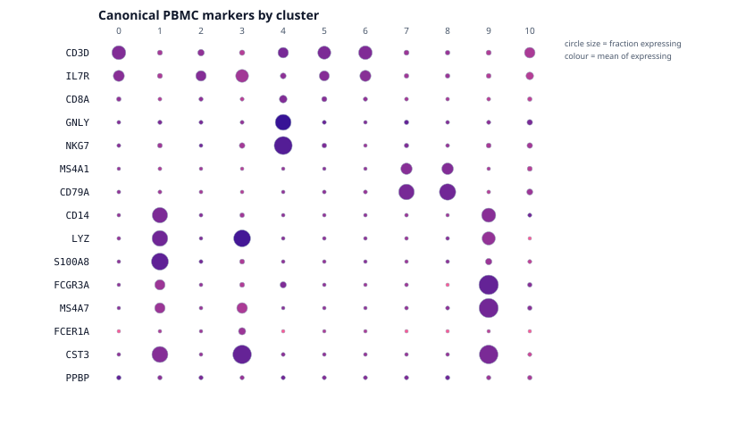
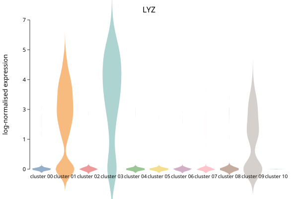
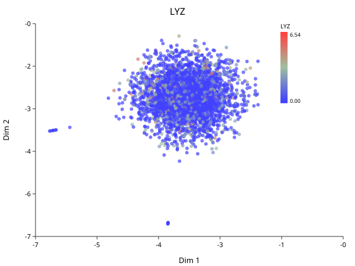

# Markers and Annotation

*Follows HBC lessons 12 (Seurat cheatsheet) and 13 (Marker identification).*

This is the chapter the whole book exists for. Everything before it is
mechanical; this is where a numbered cluster becomes a cell type.

## The panel view

The fastest way to annotate PBMCs is to ask a known marker panel where it lands.

```biolang
import "singlecell" as sc

let obj = sc.load("ctrl_raw")
    |> sc.filter_genes(3) |> sc.filter_cells(250, 100000, 20.0)
    |> sc.normalize() |> sc.variable_genes(2000) |> sc.run_pca(30)
    |> sc.neighbors(15) |> sc.cluster_leiden(15, 0.5)

let panel = ["CD3D","IL7R","CD8A","GNLY","NKG7","MS4A1","CD79A",
             "CD14","LYZ","S100A8","FCGR3A","MS4A7","FCER1A","CST3","PPBP"]

write_text("dotplot.svg",
    sc.expr_dotplot(obj, panel, "Canonical PBMC markers by cluster"))
```



Read it and the annotation falls out:

| Cluster | Markers | Cell type |
|---|---|---|
| 0, 5, 6 | CD3D, IL7R | CD4 T cells |
| 2, 10 | CD3D, IL7R (weaker) | T cells |
| 4 | CD8A, **GNLY**, **NKG7** | NK / cytotoxic |
| 7, 8 | **MS4A1**, **CD79A** | B cells |
| 1 | **CD14**, **LYZ**, **S100A8** | CD14 monocytes |
| 9 | **FCGR3A**, **MS4A7** | CD16 monocytes |
| 3 | LYZ, CST3, FCER1A | dendritic cells |

Now go back and look at the [UMAP](ch05-clustering.md#looking-at-it). Clusters 1
and 9 sit together — both monocytes. Clusters 7 and 8 sit together — both B
cells. Clusters 0, 2, 5, 6 form the central mass with 4 beside them — T cells
with NK adjacent. **The layout recovered the lineage relationships without being
told them**, which is the strongest evidence available that the whole pipeline
is working.

## Why the dot plot and not a violin

The dot plot encodes two quantities at once — dot **size** is the fraction of
cells detecting the gene, dot **colour** is mean expression among those cells —
and that pairing is exactly what separates a real marker from an artifact.

A large pale dot means "expressed in most cells of this cluster, weakly". A small
intense dot means "a few cells, strongly", and usually means be suspicious.

A violin hides this. Two clusters with identical violins can differ completely in
what fraction of their cells express the gene at all:

```biolang
import "singlecell" as sc

let obj = sc.load("ctrl_raw")
    |> sc.filter_genes(3) |> sc.filter_cells(250, 100000, 20.0)
    |> sc.normalize() |> sc.variable_genes(2000) |> sc.run_pca(30)
    |> sc.neighbors(15) |> sc.cluster_leiden(15, 0.5)

write_text("violin-LYZ.svg", sc.plot_violin(obj, "LYZ"))
write_text("feature-LYZ.svg", sc.plot_feature(obj, "LYZ"))
```





LYZ is high in clusters 1, 3 and 9 and near zero elsewhere — the monocytes and
dendritic cells, and nothing else. The feature plot says the same thing spatially.

## Finding markers you did not know to look for

The panel above assumes you already know PBMC biology. When you do not:

```biolang
import "singlecell" as sc

let obj = sc.load("ctrl_raw")
    |> sc.filter_genes(3) |> sc.filter_cells(250, 100000, 20.0)
    |> sc.normalize() |> sc.variable_genes(2000) |> sc.run_pca(30)
    |> sc.neighbors(15) |> sc.cluster_leiden(15, 0.5)

let markers = sc.marker_table(obj, 1, 0)
println(head(markers, 8))
```

`marker_table(obj, a, b)` compares two clusters. The columns:

| Column | Meaning |
|---|---|
| `log2fc` | Log2 fold change between the groups |
| `pct_a`, `pct_b` | Fraction of cells in each group detecting the gene |
| `pvalue` | Raw test p-value |
| `padj` | After multiple-testing correction |

## Read pct before you read p

The p-values here will be tiny — often reported as zero. **Do not take them
seriously as evidence.**

The test asks "could these two groups have the same expression?", and you already
know the answer is no, because you *defined* the groups by clustering on this
same expression data. The clustering separated the cells; the test then confirms
they are separated. That is circular, and it is why marker p-values are best read
as a ranking device rather than as inference. A published p-value of 10⁻³⁰⁰ from
a marker table means "this gene ranked high", not "this finding is certain".

The columns carrying real information are `pct_a` and `pct_b`. A gene detected in
95% of cluster cells and 5% of the rest is a usable marker regardless of its
p-value. A gene with a huge fold change detected in 10% of the cluster is not —
it is a few cells with high counts, and it will not replicate.

**Rank by fold change, filter by detection rate, use the p-value only to break
ties.**

## Markers against everything else

Comparing one cluster to one other answers a narrow question. Usually you want
each cluster against all remaining cells:

```biolang
import "singlecell" as sc

let obj = sc.load("ctrl_raw")
    |> sc.filter_genes(3) |> sc.filter_cells(250, 100000, 20.0)
    |> sc.normalize() |> sc.variable_genes(2000) |> sc.run_pca(30)
    |> sc.neighbors(15) |> sc.cluster_leiden(15, 0.5)

write_text("markers.svg", sc.plot_markers(obj, 5))
```

The underlying `find_all_markers` builtin runs a Mann-Whitney U test per gene per
cluster and applies **one** Benjamini-Hochberg correction across the whole table,
not per cluster. Correcting within each cluster separately would understate the
multiple-testing burden, since the family is every test you ran.

## From markers to cell types

This step is manual, and there is no honest way around it. You match marker genes
against known biology — literature, marker databases, or a reference atlas — and
assign names.

Three cautions the course is right to stress:

**A cluster without a clean marker set may not be a cell type.** It may be
doublets, stressed cells, or an over-split fragment of a real population. Cluster
10 above has 32 cells; look at its markers before giving it a name.

**Markers are context-dependent.** A gene marking a population in blood may mark
something else in tumour. Markers from a PBMC atlas do not transfer unexamined to
solid tissue — and this dataset *is* the PBMC atlas case, which is why it works
so cleanly here.

**Record your reasoning.** "Cluster 1 = monocytes" is not reproducible.
"Cluster 1: CD14+ LYZ+ S100A8+, FCGR3A−, 3714 cells — classical CD14 monocytes"
is. Six months later you will not remember, and a reviewer cannot check the first
version at all.

## The Seurat verbs, translated

For readers coming from the course's R:

**Read this as "the step that occupies the same slot", not "the same
computation".** Several of these are approximations, and the ones that are
carry a note. A table of bare equivalences would be easier to read and would
mislead you about exactly the things that make numbers differ.

| Seurat | BioLang | |
|---|---|---|
| `CreateSeuratObject` | `sc.load` / `sc.from_matrix` | |
| `PercentageFeatureSet` + `subset` | `sc.qc` → `sc.filter_cells` | `filter_cells` has no UMI floor or complexity term — see [Quality Control](ch02-quality-control.md) |
| `NormalizeData` | `sc.normalize` | equivalent |
| `SCTransform` | `sc.sctransform` | independent implementation of the same method — see below |
| `FindVariableFeatures` | `sc.variable_genes` | dispersion, unbinned; Seurat's `vst` bins by mean first. Under SCTransform, use `sc.sctransform(obj, n)` instead |
| `RunPCA` | `sc.run_pca` | subspace iteration; Seurat uses irlba |
| `ElbowPlot` | `sc.plot_elbow` | |
| `FindNeighbors` | `sc.neighbors` | SNN with Jaccard weights, same as Seurat. Neighbour search is exact here, approximate (Annoy) there |
| `FindClusters` | `sc.cluster_louvain` | Louvain with 10 restarts, matching `algorithm = 1, n.start = 10`. `sc.cluster_leiden` is the better algorithm but not the one the course ran |
| `RunUMAP` + `DimPlot` | `sc.plot_umap` | |
| `FindMarkers` | `sc.marker_table` | |
| `FindAllMarkers` | `find_all_markers` | |
| `FeaturePlot` | `sc.plot_feature` | |
| `VlnPlot` | `sc.plot_violin` | |
| `DotPlot` | `sc.expr_dotplot` | |
| `RunHarmony` | `sc.harmony` | **not `sc.integrate`**, which only centres each batch per gene |
| `merge` | `sc.merge` | |

### How close `sc.sctransform` is

It implements the same method: a negative binomial per gene, overdispersion
estimated by maximum likelihood, then *regularized* by smoothing those estimates
across genes of similar expression. The regularization is the point of the
method and what the paper's title refers to. Residuals are clipped at
`sqrt(n_cells/30)`, the published default.

It is an independent implementation written from
[Hafemeister & Satija 2019](https://doi.org/10.1186/s13059-019-1874-1) and
[Choudhary & Satija 2022](https://doi.org/10.1186/s13059-021-02584-9), not a
translation — the reference is GPL-3 and BioLang is MIT.

**An earlier version of this page said `sc.sctransform` used a fixed
overdispersion of 100 for every gene. That was true when written.** It shared
the residual formula with the method and none of the regularization, which is
most of it.

One known divergence remains: bandwidth for the smoothing uses Silverman's rule
where the reference uses the Sheather-Jones plug-in, so the smoothed
overdispersion curve differs slightly.

## Next

Everything above in one script: [The Whole Workflow](ch07-workflow.md).
